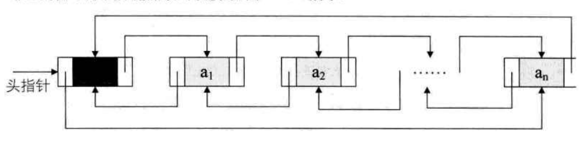

# 线性表

定义： 0个或多个数据元素的有限序列

## 顺序存储结构

用一段`连续的存储单元`依次存储线性表的数据元素

可以用 1维数组来表示

代码实现见 [顺序线性表.go](../数据结构代码/0301顺序线性表.go)

## 单链表

节点：对某个数据元素，除了存储其本身的信息外，还需要存储一个指示其直接后继的信息，这个信息叫做`链`或`指针`。这两部分信息组成数据元素ai的存储印象，称为节点`node`

链表：n个节点链接成一个链表，即为线性表的链式存储结构

可以在链表的第一个节点前附设一个结点，称为`头结点`

链表中第一个节点的存储位置称为`头指针`,即代表这个链表的名字

代码实现见 [单向链式线性表.go](../数据结构代码/0302单向链式线性表.go)

## 循环链表

在最后一个结点的指针域存储头结点的地址

改用尾指针来处理，查找终端结点是O(1),起始结点也是是O(1)

## 双向链表

每个节点不仅存储下一个节点的指针，还要存储上一个节点的指针

  

代码实现见[单向链式线性表.go](../数据结构代码/0303双向链表.go)
