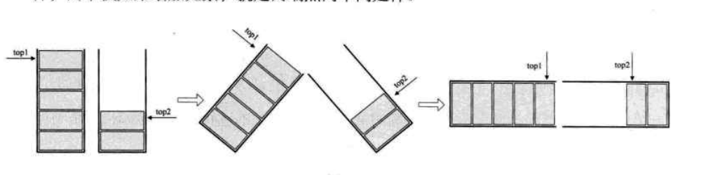
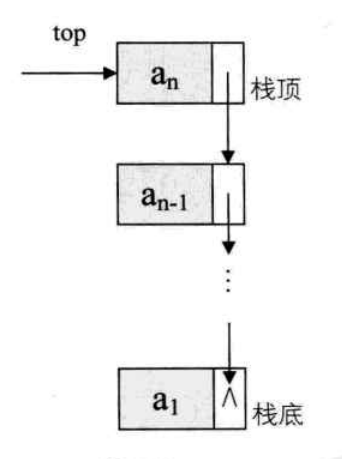
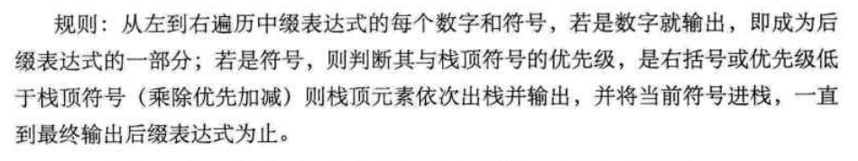
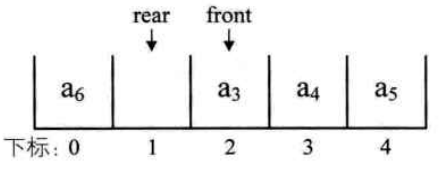
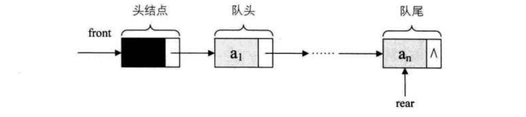

# 栈与队列

`栈`是限定仅在表尾进行插入和删除操作的线性表
`队列`：只允许在一端进行插入操作，而在另一端进行删除操作的线性表

## 栈

`栈`是限定仅在表尾进行插入和删除操作的线性表
`栈顶`：允许插入和删除的一端，另一端为`栈底`

又称为`先进后出`的线性表

`进栈`：栈的插入操作，在栈顶插入数据
`出栈`：栈的删除操作，删除栈顶的元素

有多种出栈的顺序

### 栈的顺序存储结构及实现

栈的顺序存储其实也是线性表顺序存储的简化，简称为`顺序栈`

一般讲下表为0的一端作为栈底，因为首元素都在栈底，变化最小

定义一个变量 `top` 来指示栈顶元素在数组中的位置，存在一个元素时top=0，为空则为-1,栈满为 len-1

```go
const MaxSize=999
type SqStack struct{
    data [MaxSize]interface{}
    top int
}
```

代码实现见 [0401实现存储栈](../数据结构代码/0401顺序存储栈.go)

push和pop都没有涉及到循环语句，因此时间复杂度为O(1)

### 两栈共享空间

一个数组，长度为n，一个栈的栈底为数组的起始端，即下标0处，另一个栈底为数组的末端，即下标n-1处

两个栈如果增加元素，就是两端点向中间延伸



当 `top+1=top2` 时，数组满了，即2个栈都满了

```go
const MaxSize=999
type SqDulStack struct{
    data [MaxSize]interface{}
    top1 int
    top2 int
}
```

代码实现见[0402双栈顺序存储](../数据结构代码/0402双栈顺序存储.go)

适用情况：两栈需求有相反关系，即一个增长时另一个减小，否者都增长没有意义

### 栈的链式存储结构及实现

栈底即链表的头结点，或者没有头结点，又或者人人都是头结点

链的最后一个节点就是栈的top的位置

插入即头插法，这样top一直都是头结点或者第一个节点

  

代码实现见[0403单链表链栈](../数据结构代码/0403单链表链栈.go)

### 栈的应用

1. 递归
斐波那契数列
`递归`：一个直接调用自己或通过一些列的调用语句间接地调用自己的函数，称作递归函数
每个递归至少有一个结束条件
迭代使用循环结构，递归使用选择结构，能使程序的结构更加清晰，简洁
在递归的前行阶段，对于每一次递归，函数的局部变量，参数值，以及返回的地址都压入栈中，退回时，栈底的变量被弹出

2. 四则运算表达式求值
`后缀表示法`: 所有的运算符号在要运算的数字的后面出现
例子：以下中缀运算式

    ```math
    9+(3-1)*3+10/2
    ```

    转为：
    9 3 1 - 3 * + 10 2 / +

转换方法：
  

计算机在计算时，从左到右遍历后缀表达式的每个数字和符号，遇到数字就进栈，遇到的是符号，就将栈顶的2个数组出栈计算，先出栈的在运算符的左边，后出的在运算符的右边，然后将计算结果再次入栈，一直到最终的结果。

## 队列

只允许在一端进行插入操作，而在另一端进行删除操作的线性表
是一种先进先出的线性表，简称FIFO，允许插入的一端称为`队尾`，允许删除的一端称为`队头`

如果队列是单向的，就会遇到空间不足的问题，进而导致假溢出的情况出现，所以出现了循环队列，即当后面满了的时候，就从头再开始，将前面的元素再次填满。

### 循环队列

队列的头尾相接的顺序存储结构称为循环结构

  

`队列满的条件`：

```math
(real+1)%QueueSize == front
```

`队列长度计算公式：`

```math
(real - front + QueueSize)%QueueSize
```

数据结构如下：

```go
const MaxSize = 999
type SqQueue struct{
    queue [MaxSize]interface{}
    front int
    rear int
}
```

代码见[0404循环顺序队列](../数据结构代码/0404循环顺序队列.go)

### 链式存储结构

不需要担心队列长度的链式存储结构

其实是线性表的单链表，只是只能尾进头出而已。简称为`链队列`

  

链中应包含头节点（头删）和尾节点（尾插）

数据结构如下：

```go
type QNode struct{
    data interface{}
    next *QNode
}
type LinkQueue struct{
    font *QNode
    rear *QNode
}
```

代码实现见[0405链式队列](../数据结构代码/0405链式队列.go)

### 比较

时间上，都是O(1)，但是链队列的空间分配和释放有一定开销，存在细微差异
空间上，循环队列有固定长度，存在空间浪费的问题，链式更加灵活。
