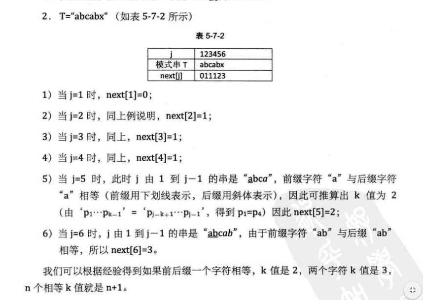

# 串

`串`是由零个或多个字符组成的有限序列，又名`字符串`

s="a1a2a3a4...."

`子串`：串中任意个数字符组成的子序列称为该串的子串，子串在主串中的位置就是其第一个字符在主串中的序号

## KMP模式匹配算法

大大减少重复遍历的情况
根据前缀表，确下一次要匹配的位置

1. 先求出前缀表
当匹配串的第i个元素前面的字符串中，有前缀和后缀相同，记录其最大的前缀长度为n，则前缀表的第i个值 `n[j]` 满足以下关系：
  
例子：
  

2. 再次遍历主串，在j指针需要回溯时，根据前缀表确定回溯的位置，并再次比较。

代码见[KMP算法](../DataStructure/0501KMP算法.go)

