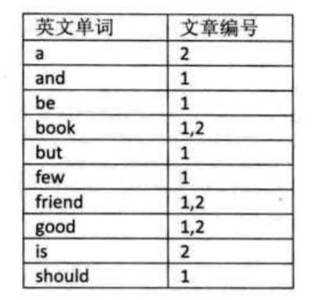
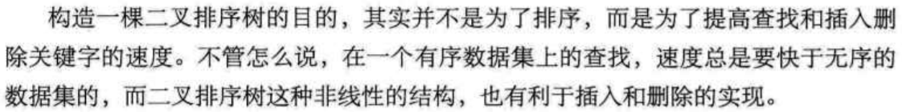

# 查找

## 顺序查找

遍历

优化：哨兵法

```go
func Sequential_Search2(arr []int,key interface{}){
    i:=len(arr)
    arr[0]=key
    for arr[i]!=key{
        i--
    }
    return i //返回0则说明查找失败
}
```

实际上这个代码是有问题的，把传进来的数组的第一个元素的值改变了

## 有序表查找

对排好顺序的表进行查找

### 折半查找

又称二分查找
前提：线性表中的记录必须是关键码有序（从小到大），必须采用顺序存储。
基本思想：在有序表中，取中间记录作为比对象，若相等，则成功；若小于，则在左半区查找，若大于，则在右半区查找，直到查找成功，或所有区域无记录，查找失败为止。
代码：mid=(low+hogh)/2+1
时间复杂度：O(logn)

### 插值查找

根据要查找的关键字key与查找表中最大最小记录的关键字比较后的查找方法
对折半查找进行改进，主要是改变mid的计算方式

```math
mid=low + [(key-a[low])/a[high]-a[low]]*(high-low) + 1
```

### 斐波那锲查找

根据斐波那锲数组对mid进行限制

## 线性索引查找

索引：把一个关键字与它对应的记录相关联的过程
可分为：线性索引，树形索引，多级索引
线性索引：将索引项集合组织为线性结构，也称为索引表

### 稠密索引

在线性索引中，将数据集中的每个记录对应一个索引项

### 分块索引

把数据集的记录分成若干块，并且这些块需要满足两个条件：

1. 块内无序
2. 块间有序

时间复杂度：O(log2^1/2)

普遍用于数据库表查找等技术应用

### 倒排索引

索引项通用结构：

1. 次关键码
2. 记录号表：存储具有相同 次关键字 的所有记录的记录号（可以是指向记录的指针或者是该记录的主关键字）

  

## 二叉排序树

### 定义

`二叉排序树`又称为`二叉查找树`，它或者是一颗空树，或者是具有下列性质的二叉树：

1. 若左子树不为空，则左子树上所有的节点的值均小于他的根结构的值
2. 若右子树不为空，则右子树上所有的节点的值均大于他的根结构值
3. 他的左右子树也分别为二叉排序树

  

### 查找
