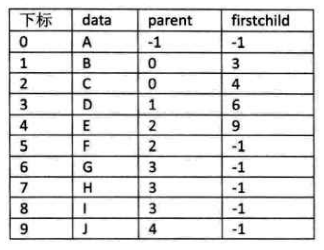

# 树

## 定义

`树`是 n(n>=0)个节点的有限集。n=0时称为空树。在任意一颗非空树中：

1. 有且仅有一个特点的称为`根（Root）`的节点
2. 当n>1时，其余节点可分为m（m>0）个互不相交的有限集 T1,T2,...其中每一个集合本身又是一颗树，并且称为根的`子树（SubTree）`

  

注意：

1. n>0时，根节点是唯一的
2. m>0时，子树的个数没有限制，但他们一定是互补相交的。

### 节点的分类

`度`：节点拥有的子树数称为节点的度

`叶节点（终端节点）`：度为0的节点

`分支节点`：度不为0的节点

`树的度`：树内各节点度的最大值

  

### 节点间关系

`孩子（Child）`：节点的子树的根称为该节点的Child，该节点称为孩子的`双亲（Parent）`

同一双亲的孩子之间互称`兄弟（Sibling）`

`祖先`：从跟到该节点所经分支上的所有节点

`子孙`：以某节点为跟的子树中的任一节点都称为该节点的子孙
  

### 其他关系

`层次`:从根开始定义起，根为第一层，根的孩子为第二层，以此类推

`深度`：树中节点的最大层次称为树的深度（Depth）或高度

  

## 树的存储结构

### 双亲表示法

采用顺序存储结构，每个元素中附带一个指示器，存储其双亲节点到链表中的位置

```go
const MaxSize 999
type PTNode struct{
    data interface{}
    parent int
}
type PTree struct{
    nodes [MaxSize]PTNode //节点数组
    r int //节点数组
    n int //节点个数
}
```

这样的存储结构，可以更根据节点的parent指针很容易找打他的双亲节点，但是不知道子节点，需要遍历

  

可以再加存储结构，比如长子域，右兄弟域等等

### 孩子表示法

从上到下表示
使用多重链表，每个节点有多个指针域，其中每个指针指向一颗子树的根节点
每个节点的度，即他的孩子的个数是不同的

1. 指针域的个数就是树的度。
  
  
这种预先分配好域个数的做法不够灵活，容易造成空间浪费或空间不够

2. 额外存储一个度域，标识该节点度的个数
  
  
遇到这种长度不缺定的问题，快进到链表
3. 把每个节点的孩子节点排列起来，以单链表作为存储结构，则 n 个节点有n个孩子链表，若是叶子节点，则此单链表为空。然后n个头指针又组成一个线性表，采用顺序存储结构，存进一个一维数组中  
即实际上每个节点还是存储在线性表中，只是把他的孩子节点的**位置**存在链表里，因为孩子节点的长度不确定，用链表可以动态分配。你也可以把他的parent节点位置存储起来。如下图
  
这种设计需要2个结构，一个是实际的节点，存储数据和孩子节点，另一个就是孩子节点，存储孩子节点的下标，孩子节点组成的链表就代表了该节点所有的孩子节点

    ```go
    type CTNode struct{
        child int //下标位置
        next *CTNode //下一个节点
    }
    type CTBox struct{
        data interface{}//存储的数据
        firstChild *CTNode//长子节点的位置
        parent int//双亲节点位置
    }
    type CTree struct{
        nodes [MaxSize]CTBox
        r int//跟位置
        n int//长度
    }
    ```

### 孩子兄弟表示法

现象：任意一颗树，他的节点的第一个孩子如果存在就唯一（只有一个长子），它的右兄弟存在也是唯一，可以当做此节点的标识，指针域存储该节点的第一个孩子和此节点的右兄弟。


```go
type CSNode{
    data interface{}
    firstChild *CSNode
    rightSib *CSNode
}
```


## 二叉树

二叉树是由n个节点组成的有限集合，该集合或者称为空集，或者由一个根节点和两颗互不相交的、分别称为根节点的左子树和右子树的二叉树组成

特点：

1. 每个结点最多有2个子树
2. 左子树和右子树是有顺序的，次序不能任意颠倒。
3. 即使某节点只有一棵子树，也要区分它是子树还是右子树

5种基本形态：

1. 空二叉树
2. 只有1个节点
3. 根节点只有左子树
4. 根节点只有右子树
5. 根节点既有左子树也有右子树

特殊二叉树：

1. 斜树：所有节点只有左子树或右子树的二叉树
2. 满二叉树：所有分支节点都存在左子树和右子树，并且所有叶子都在同一层上，这样的二叉树称为满二叉树
3. 完全二叉树：如果二叉树中除去最后一层节点为满二叉树，且最后一层的结点依次从左到右分布

## 二叉树的性质

1. 在二叉树的第i层上至多有2^(i-1)个节点
2. 深度为k的二叉树至多有2^k-1个节点
3. 对任意一颗二叉树T，如果其终端节点数为n,度为2的节点数为m，则 n=m+1
4. 具有n个节点的完全二叉树的深度为`[log2n]+1`
5. 如图
  

## 二叉树的存储结构

### 顺序存储结构

用一维数组存储二叉树中的节点，并且节点的存储位置也就是下标要体现节点之间的逻辑关系

1. 完全二叉树
直接顺序存储，下标就是节点的位置，严格对应
2. 一般二叉树
空的补^

### 二叉链表

因为二叉树每个节点最多有2个孩子，所以设计一个数据域和2个指针域

```go
type BitNode{
    data interface{}
    lchild *BitNode
    rchild *BitNode
}
```

结构如图
  

## 遍历二叉树

从根节点出发，按照某种**次序** **依次**访问二叉树中的所有节点，使得每个节点被访问一次且仅被访问一次

若规定从左到右，则主要分4种：

### 1. 前序遍历

从根节点开始，遍历每个节点的左子树，直到最后一层，然后再依次遍历上一次的节点  
考察到一个节点后，即刻输出该节点的值，并继续遍历其左右子树。(根左右)
  

### 2. 中序遍历

先从遍历根节点的左子树，从最左边的叶子节点开始再中序遍历，然后访问根节点，最后中序遍历右子树  
考察到一个节点后，将其暂存，遍历完左子树后，再输出该节点的值，然后遍历右子树。(左根右)
  

### 3. 后序遍历

从左到右先叶子后节点的方式遍历访问左右子树，最后访问根节点  
考察到一个节点后，将其暂存，遍历完左右子树后，再输出该节点的值。(左右根)
  

### 4. 层序遍历

从上而下逐层遍历
  

代码见[0601二叉链表及遍历](../DataStructure/0601二叉链表.go)

## 线索二叉树

节点中存储指向前继和后继的指针的二叉链表叫做线索链表，相应的二叉树称为`线索二叉树`

对二叉树以某种次序遍历，然后修改空指针，使其变为线索二叉树的过程称作是线索化

  

```go
const Link=0
const Thread=1
type BiThrTree struct{
    data interface{}
    lChild *BiThrTree
    lTag int
    rChild *BiThrTree
    rTag int
}
```

线索化之后，对其进行遍历就等于操作一个双向链表结构

在链上添加一个头结点，并令其lchild指向根节点，rchild指向中序遍历的最后一个节点。反之同理。
  

应用场景：经常需要遍历或者查找节点需要遍历序列中的前驱和后继

代码见[0602线索化](../DataStructure/0602线索化.go)

## 森林、树、二叉树的转换

### 树<->二叉树

  

  

### 森林<->二叉树

森林<->树<->二叉树

  

  

## 赫夫曼树

`路径`：从树中一个节点到另一个节点之间的分支构成两个节点之间的路径，路径上分支数目称为`路径长度`
`树的路径长度`就是从树根到每一节点的路径长度之和

`带权路径长度`：该节点到树根节点之间的路径长度与节点上权的乘机

`赫夫曼树`：设有n个权值，对应n个叶子节点，每个叶子的路径为lk，则其中带权路径长度WPL最小的二叉树称为赫夫曼树

构造方法：

1. 将有权值的叶子节点按照从小到大排列成序列
2. 取2个最小权值的节点作为一个新节点N1的两个子节点，较小的为左子树，新节点的权值为2个叶子节点的权值和
3. 将N1代替原先2个节点，插入到序列中
4. 重复2，将N1与下一个叶子节点组合，直到只含一颗树

当时主要是解决电报传输问题，将字符编码进行压缩
