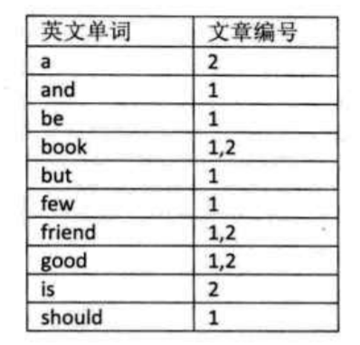
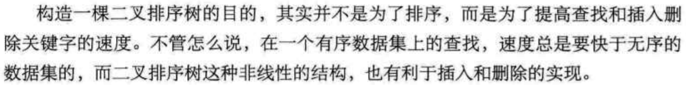

# 查找

## 顺序查找

遍历

优化：哨兵法

```go
func Sequential_Search2(arr []int,key interface{}){
    i:=len(arr)
    arr[0]=key
    for arr[i]!=key{
        i--
    }
    return i //返回0则说明查找失败
}
```

实际上这个代码是有问题的，把传进来的数组的第一个元素的值改变了

## 有序表查找

对排好顺序的表进行查找

### 折半查找

又称二分查找
前提：线性表中的记录必须是关键码有序（从小到大），必须采用顺序存储。
基本思想：在有序表中，取中间记录作为比对象，若相等，则成功；若小于，则在左半区查找，若大于，则在右半区查找，直到查找成功，或所有区域无记录，查找失败为止。
代码：mid=(low+hogh)/2+1
时间复杂度：O(logn)

### 插值查找

根据要查找的关键字key与查找表中最大最小记录的关键字比较后的查找方法
对折半查找进行改进，主要是改变mid的计算方式

```math
mid=low + [(key-a[low])/a[high]-a[low]]*(high-low) + 1
```

### 斐波那锲查找

根据斐波那锲数组对mid进行限制

## 线性索引查找

索引：把一个关键字与它对应的记录相关联的过程
可分为：线性索引，树形索引，多级索引
线性索引：将索引项集合组织为线性结构，也称为索引表

### 稠密索引

在线性索引中，将数据集中的每个记录对应一个索引项

### 分块索引

把数据集的记录分成若干块，并且这些块需要满足两个条件：

1. 块内无序
2. 块间有序

时间复杂度：O(log2^1/2)

普遍用于数据库表查找等技术应用

### 倒排索引

索引项通用结构：

1. 次关键码
2. 记录号表：存储具有相同 次关键字 的所有记录的记录号（可以是指向记录的指针或者是该记录的主关键字）

  

## 二叉排序树

### 定义

`二叉排序树`又称为`二叉查找树`，它或者是一颗空树，或者是具有下列性质的二叉树：

1. 若左子树不为空，则左子树上所有的节点的值均小于他的根结构的值
2. 若右子树不为空，则右子树上所有的节点的值均大于他的根结构值
3. 他的左右子树也分别为二叉排序树

  

### 查找

根据节点和左右子树的关系遍历

### 插入

根据节点和左右子树的关系遍历

### 删除

稍难，要分3种情况判断：叶子节点，独子节点，双子节点

1. 叶子节点：直接删除即可
2. 独子节点：将独子交给此节点的双亲节点
3. 双子节点：找到这个节点的直接前驱和直接后驱进行替换

代码见[0802二叉排序树查找](../DataStructure/0802二叉排序树查找.go)

二叉排序树的查找是从头向下遍历，该树的深度决定了所需的时间复杂度，所以树的形状越平衡越好。

## 平衡二叉树

`平衡二叉树`：是一种二叉排序树，其中每一个节点的左子树和右子树的高度差至多等于1

构建思想：每插入一个节点，先检查是否破坏了平衡性，如果破坏了，则找出最小不平衡树，然后进行调整

当最小不平衡子树根节点的平衡因子BF大于1时，就右旋（减小）；小于-1时，左旋（增大）

代码见[0803平衡二叉树](../DataStructure/0803平衡二叉树.go)

## 多路查找树（B树）

`多路查找树`：其每一个节点的孩子数可以多于两个，且每一个节点处可以存储多个元素

### 2-3 树

`2-3树`：每一个节点都具有2个孩子（2节点）或3个孩子（3节点）
一个2节点包含一个元素和两个孩子，且必须有2个或0个孩子，不能只有1个孩子
一个3节点包含一大一小2个元素和三个孩子，且必须是3个孩子或0个孩子
所有的叶子节点再同一层次上

在增加和删除操作时需要满足以上条件，要对原来的节点进行改造

### 2-3-4

在2-3树的基础上新增一个4节点，包含3个元素和4个孩子

### B树

`B树`是一种平衡的多路查找树，节点最大的孩子数目称为B树的阶

适合带有范围的查找

## 散列表查找（哈希表）

`散列技术`：在记录的存储位置和它的关键字之间建立一个确定的对应关系f，使得每个关键字key对应一个存储位置f(key)
`散列函数（哈希函数）`：f
`散列表(哈希表)`：采用散列技术将记录存储在一块连续的存储空间中，这块连续的存储空间称为散列表或哈希表

### 散列表查找步骤

1. 在存储时，通过散列函数计算记录的散列地址，并按照散列地址存储该记录。
2. 当查找时，通过同样的散列函数计算记录的地址的散列地址，按照散列地址访问该记录

散列技术最适合的求解问题是查找与给定值想的的记录

`哈希冲突`：两个关键字key1!=key2,但是f(key1)==f(key2),这种现象我们称为冲突，并把key1，key2称为这个散列函数的同义词

## 哈希函数的构造方法

### 原则

1. 计算简单
2. 散列地址分布均匀

### 方法

1. 直接定址法
f(key)=a*key+b
简单均匀不冲突但也不常用

2. 数字分析法
对需要存储的key进行一定的处理分析，抽取一部分
使用关键字的一部分来计算散列存储位置

3. 平方取中法
1234 —— 平方 ——> 1522756 —— 取中间3位 ——> 227
适合于不知道关键字的分布，而位数又不是很大的情况

4. 折叠法
将关键字从左到右分割成位数相等的几部分，然后叠加求和，并按散列表表长，取后几位作为散列地址

5. 除留余数法
较常用的，f(key)=key/p(p<=m)
需要选取合适的p

## 处理散列冲突的方法

### 开放定址法

一旦发生了冲突，就去寻找下一个空的散列地址，只要散列表足够大，空的散列地址总能够找到，并将记录存入

1. 线性探测法
 f(key)=(f(key)+di)%m,(di=1,2,3,...m-1)
2. 二次探测法
 不让关键字都聚集在某一块区域
 f(key)=(f(key)+di)%m,(di=1^2,-1^2,2^2,-2^2)
3. 随机探测法
 使用随机函数计算位移量di
 f(key)=(f(key)+di)%m,(di是一个随机数列)

### 再散列函数法

事先准备多个散列函数
f(key)=RHi(key),(i=1,2,...k)

等等

简单代码实现见
